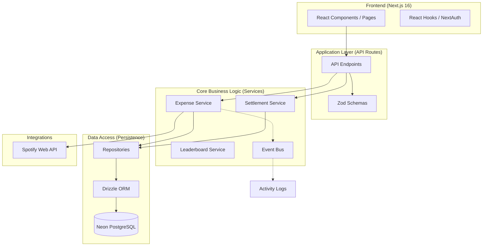
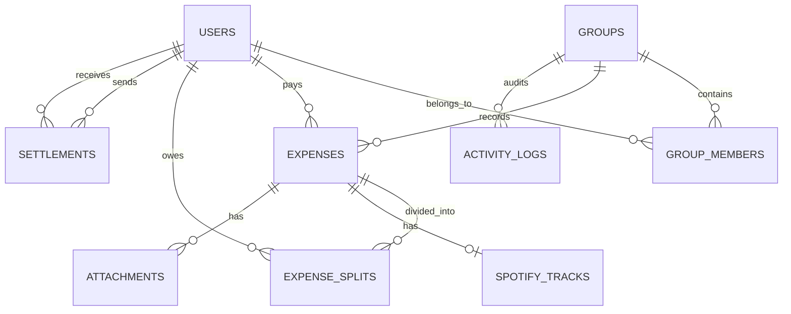

# Smart Split Elite 💎

A sophisticated, production-grade expense management platform engineered for precision, speed, and collaborative financial tracking.

[](https://nextjs.org/)
[](https://orm.drizzle.team/)
[](https://neon.tech/)

---

## 🤖 Built with AI Agents

This project is a flagship example of **Agentic Development**. It was constructed through a deep collaboration between a human architect and a swarm of specialized AI agents:
- **Google Gemini 3.1 Pro & Flash**: Orchestrated high-level architecture and complex financial logic.
- **Antigravity**: Managed the workspace, handled large-scale refactors (like the UPI excision), and optimized the Docker environment.
- **Code Review Graph**: Maintained a structural map of the project, ensuring consistency across the database, services, and UI.

---

## 🏛️ High-Level Architecture (HLD)

The project follows a **Clean Architecture** approach, ensuring separation of concerns and high testability.



---

## 💎 Features & Benefits

### 1. Financial Precision Engine
- **The Problem**: Standard splitters often lose 1-2 paise due to floating-point division (e.g., ₹100 / 3).
- **The Solution**: Our **Remainder Algorithm** ensures that the sum of splits *always* matches the total amount by intelligently assigning the fractional remainder.
- **Benefit**: Accountants and precision-obsessed users can trust the math 100%.

### 2. Multi-Strategy Splitting
- **Options**: `Equal`, `Exact`, `Percentage`, `Exclude`, and `Adjustment`.
- **Benefit**: Handles everything from simple dinners to complex rent splits where one person has a larger room.

### 3. Min-Transaction Settlement Algorithm
- **The Problem**: In a group of 5, you might have 10 messy debts.
- **The Solution**: Uses a **Greedy Flow-based Algorithm** to simplify the debt web into the minimum number of payments.
- **Benefit**: Reduces social friction by minimizing the number of transactions needed to settle up.

### 4. Social Integration (Spotify)
- **Feature**: Attach a Spotify track to any expense.
- **Benefit**: Turns a boring "Grocery bill" into a shared memory. "Remember that road trip where we played this song on loop?"

### 5. Leaderboard & Gamification
- **Metric**: Ranks members based on spending and promptness in settling.
- **Benefit**: Encourages positive financial behavior within the group.

---

## 🔄 Core Workflow

### 1. Group Formation
- **User A** creates a "Europe Trip" group.
- System generates a unique `joinCode`.
- **User B** & **User C** enter the code to join instantly.

### 2. Expense Lifecycle
- **Add Expense**: Enter amount, description, and category.
- **Split Strategy**: Choose how to divide (e.g., User B pays 60%, User C pays 40%).
- **Attachments**: Snap a photo of the receipt for proof.
- **Spotify**: Add the "Theme Song" of the night.

### 3. Debt Reconciliation
- View the **Settlement Plan** generated by the engine.
- **Payer** records a settlement in the app.
- **Receiver** gets a notification and must **Confirm** the receipt of funds.
- Balances are updated in real-time.

---

## 🗄️ Database Schema (LLD)



---

## 🛠️ Tech Stack Rationale

| Layer | Technology | Rationale | Benefit |
| :--- | :--- | :--- | :--- |
| **Framework** | **Next.js 16** | Server-first architecture (RSC). | Minimal client-side JS, ultra-fast LCP. |
| **ORM** | **Drizzle ORM** | SQL-first, zero-runtime overhead. | Type safety without sacrificing performance. |
| **Database** | **PostgreSQL (Neon)** | Serverless Postgres with branching. | Instant dev environments and zero cost at rest. |
| **Auth** | **NextAuth.js** | Industry-standard session management. | Secure OAuth and encrypted credentials. |
| **Testing** | **tsx + pg-mem** | In-memory Postgres for tests. | Sub-second test execution without DB latency. |
| **Deployment**| **Docker** | Containerized environment. | "Works on my machine" guaranteed across teams. |

---

## 🚀 Development Workflow

### Local Setup
1. **Clone & Install**:
   ```bash
   git clone <repo-url>
   npm install
   ```
2. **Environment**:
   Set up `.env.local` with your Neon `DATABASE_URL` and NextAuth secrets.
3. **Database Migration**:
   ```bash
   npx drizzle-kit push
   ```
4. **Run Tests**:
   ```bash
   npm test
   ```
5. **Start**:
   ```bash
   npm run dev
   ```

---

## 📜 License
MIT © 2026 Abhay Bansal
